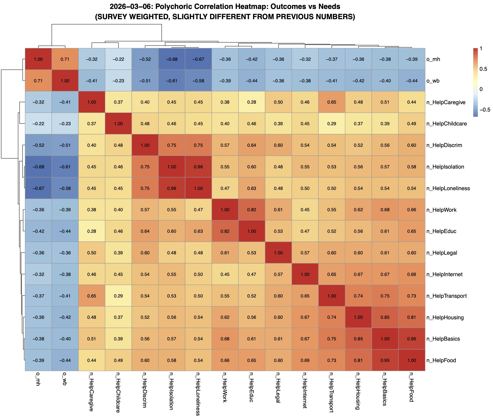
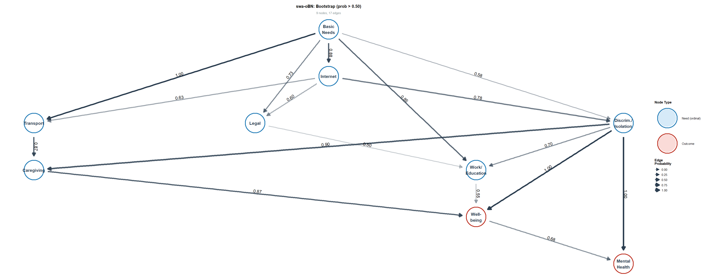

## Why Causal Discovery?

-   Correlation heatmap: **everything correlates with everything**
    -   Need items intercorrelate 0.29–0.96; all negatively with outcomes (-0.22 to -0.68)
    -   Standard regression → "all needs are associated with poor outcomes" → **clinically useless**
-   Policy requires **directional** knowledge:
    -   If VA addresses basic financial needs, does discrimination/isolation burden decrease downstream?
    -   Does intervening on work/education improve well-being directly, or only through an intermediate pathway?
-   Existing VA/SDOH literature is **entirely associational**
    -   Regression models assume causal structure; they don't discover it
    
    
::: {.callout-note}
- Building a network to see which needs are more upstream vs. more downstream with the health outcomes (i.e., well-being and mental health)
- A network adjusted for age, sex, and race/ethnicity
- Target deliverable: tree/network structure
:::
 

## Why Causal Discovery? (notes on next page)

{fig-align="center"}

## From 15 Items to 10 Nodes

-   15 raw CAHPS need items → \~4.2 × 10¹⁸ possible DAGs
    -   Computationally intractable for algorithm
    -   Individual items too granular for interpretable causal claims
-   **Polychoric correlations justify clustering: $\rho \geq 0.75$**
    -   HelpBasics / HelpFood / HelpHousing: $\rho$ = 0.85–0.95
    -   HelpWork / HelpEduc: $\rho$  = 0.82
    -   HelpDiscrim / HelpIsolation / HelpLoneliness: $\rho$  = 0.75–0.96
-   5 standalone items don't cluster: Caregiving, Childcare, Transport, Internet, Legal

::: {.callout-note}
- Factor in that these are ordinal variables and coming from survey data (so we need survey weighting): 3 levels of need
- We previously considered 0.7 as a cut point; however, for today’s discussion, we used 0.75 as the cut point
- Clusters: (1) basics/food/housing; (2) work/education; and (3) discrimination/isolation/loneliness
- 5 standalone items: (1) caregiving; (2) childcare; (3) transportation; (4) internet; and (5) legal
:::

## Final Node Set (clustering if $\rho \geq 0.75$)

| Node               | Type      | Levels | Source                             |
|--------------------|-----------|--------|------------------------------------|
| Basic Needs        | Composite | 3      | PayBasics + LackFood + HaveHousing |
| Work/Education     | Composite | 3      | FindWork + LackEduc                |
| Discrim./Isolation | Composite | 3      | Discrim + Isolation + Loneliness   |
| Caregiving         | Item      | 3      | HelpCaregive                       |
| Childcare          | Item      | 3      | HelpChildcare                      |
| Transport          | Item      | 3      | HelpTransport                      |
| Internet           | Item      | 3      | HelpInternet                       |
| Legal              | Item      | 3      | HelpLegal                          |
| Well-being         | Outcome   | 4      | o_wb                               |
| Mental Health      | Outcome   | 5      | o_mh                               |

## Assumption Diagnostics

-   **Proportional odds (Brant test)**
    -   Minor violations, nothing systematic
    -   Consistent with large-sample power issue, not genuine PO failure
    -   Post-analysis Brant on discovered parents confirms
-   **Survey weights**
    -   Report: n, n_eff, design effect, weight range
    -   No single observation dominates the pseudo-likelihood
-   **Sparse cells**
    -   No degenerate cross-tabulations
    -   All pairwise combinations have adequate cell counts

::: {.callout-note}
- Using a multinominal model to look at directionality
- Assumptions we’ve made so far seem okay (Soumik will do some more sensitivity analysis mostly in anticipation of reviewer comment/feedback)
:::

## The swa-oBN Framework

-   **Survey-weighted pseudo-BIC** corrects for sampling design
    -   Pseudo-log-likelihood targets population, not sample
    -   Kish effective sample size in penalty term
-   **Ordinal regression** breaks Markov equivalence
    -   Cumulative link model → edge direction identifiable for L ≥ 3
    -   Multinomial BNs cannot orient edges; the oBN can
-   **Two-step scoring** (new contribution)
    -   Add/delete → penalized pseudo-BIC (skeleton discovery)
    -   Reversal → unpenalized pseudo-likelihood (edge orientation)
    -   Eliminates finite-sample bias from heterogeneous ordinal levels
-   **Covariate adjustment** (Z matrix): age, race/sex
    -   Included in every node regression, excluded from DAG

## Expert Constraints

-   **Blacklist:** outcomes cannot cause needs
    -   Well-being ↛ any need variable
    -   Mental Health ↛ any need variable
    -   Encodes minimal temporal/substantive assumption
-   **No whitelist** — all need→need and need→outcome edges discovered from data
-   **Confounder adjustment** via Z matrix (not DAG nodes): Age (categorical) and Race × Sex (categorical)
    

::: {.callout-note}
- Constraint: We won’t allow for an arrow from an outcome to a need
:::

## Estimated Causal Network

{fig-align="center" width="90%"}

::: {.callout-note}
- Covariate adjusted network.
- Updated network includes “edge probability”
- Bootstrap group of networks
- The thicker/bolder the line, the more confident we are in the arrow between the two nodes (score will be between 0.0 and 1.0)
- We may not want to consider an edge <0.5

**Question: what threshold is a good cutoff for this type of network?**
:::

## Finding 1: Basic Needs Is the Upstream Hub

-   Direct edges to **6 of 8 other nodes**
    -   Transport (1.00), Work/Education (0.85), Internet (0.88)
    -   Discrim/Isolation (0.58), Caregiving (0.63), Legal (0.73)
-  Unmet basic financial needs are a **direct cause of six downstream variables**
-   **Policy implication:** addressing basic needs may cascade benefits downstream

## Finding 2: Discrim/Isolation → Outcomes

-   Most stable edges in the entire graph:
    -   Discrim/Isolation → Well-being: **1.00**
    -   Discrim/Isolation → Mental Health: **1.00**
    -   Discrim/Isolation → Work/Education: **0.70**
-   Social isolation and perceived discrimination are the **proximal causal mechanism** linking needs to outcomes
-   Not merely correlated — the DAG identifies them as the **direct pathway**
-   **Policy implication:** interventions that don't address isolation/discrimination may miss the primary channel to health outcomes. 

## Finding 3: Mental Health Is Mediated (not very sure of message here...will think more.)

-   Mental Health does **not** receive many direct edges from need variables
-   Primary pathways:
    -   Needs → Discrim/Isolation → Mental Health (1.00)
    -   Needs → Discrim/Isolation → Well-being → Mental Health (0.68)
    -   Work/Education → Well-being (0.55) → Mental Health
-   **Two-step structure:** needs don't directly damage mental health — they do so through isolation and degraded well-being
-   **Policy implication:** mental health interventions targeting needs alone, without addressing the isolation pathway, may be insufficient.

<!-- ## What Survey Weighting Changed -->

<!-- -   Compared 4 nested models: -->

<!-- | Model                    | Edges | Blacklist violations | -->
<!-- |--------------------------|-------|----------------------| -->
<!-- | Naive (no Z, no weights) | ?     | ?                    | -->
<!-- | Z-adjusted only          | ?     | ?                    | -->
<!-- | Z + weighted             | ?     | ?                    | -->
<!-- | **Full swa-oBN**         | ?     | **0**                | -->

<!-- -   Unweighted → **denser graph**, spurious edges, outcome→need violations -->
<!-- -   Weighted → **sparser, cleaner**, interpretable causal structure -->
<!-- -   Oversampling of high-need Veterans inflates apparent associations -->
<!-- ::: -->

<!-- ::: notes -->
<!-- Fill in edge counts and violation counts from step3 output -->
<!-- ::: -->

## Limitations

-   **Causal sufficiency untestable** — unmeasured confounders possible
    -   Disability rating, combat exposure, neighborhood effects
    -   Z matrix (age, race/sex) mitigates but cannot eliminate
-   **Binary items:** edge direction from BIC penalty only, not ordinal machinery
    -   Composite↔composite and composite→outcome edges are most trustworthy
-   **Naive bootstrap**, not design-appropriate (Rao-Wu)
    -   Intermediate inclusion probs (0.50–0.85) interpreted with caution
-   **Cross-sectional data** — DAG is contemporaneous, not temporal
    -   Blacklist encodes minimal temporal assumption

## Summary

1.  **Basic Needs** is the root cause hub — addressing it cascades downstream
2.  **Discrimination/Isolation** is the primary pathway to health outcomes
3.  **Mental Health** is reached through mediation, not directly from most needs
4.  **Work/Education** is downstream — not an independent root cause
5.  **Survey weighting matters** — ignoring it produces spurious causal structure
6.  **swa-oBN** provides the first formal guarantees for causal discovery from complex survey data

::: {.callout-note}
Findings:In addition to Soumik’s takeaways, we may want to include information in discussion about connection between caregiving and well-being yet caregiving not a screening priority in routine practice (e.g., not a measure in ACORN, Accountable Health Communities (AHC))
:::

